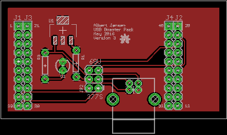

# USB Booster Pack
## For F28069 and F28377S LaunchPads
The [TMS320F28069U](http://www.ti.com/tool/launchxl-f28069m) and  [TMS320F28377S](http://www.ti.com/tool/LAUNCHXL-F28377S) microcontrollers both have USB D+ and D- pins directly on the chip. This Booster Pack provides a Female USB B connecter as well an input selection jumper, for easier connection to the USB pins.

## Firmware Examples
TI provides many examples for these two microcontrollers in their ControlSuite software. It is freely available online [here](http://www.ti.com/tool/controlsuite).

## Note
The USB connection on the booster pack **does not** supply voltage to the LaunchPad via the 3V3 or 5V pins.

## To Do
- Final Hardware Tests (need to wait until boards arrive)

## License
 
This work is licensed under a [Creative Commons Attribution-ShareAlike 3.0 Unported License](http://creativecommons.org/licenses/by-sa/3.0/)
